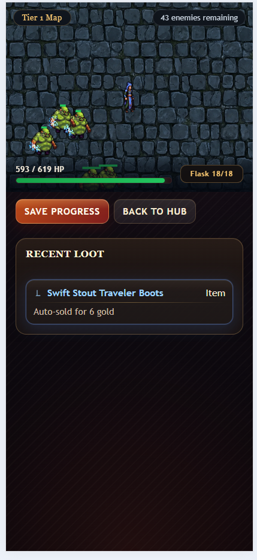
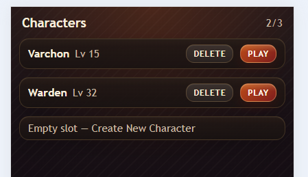
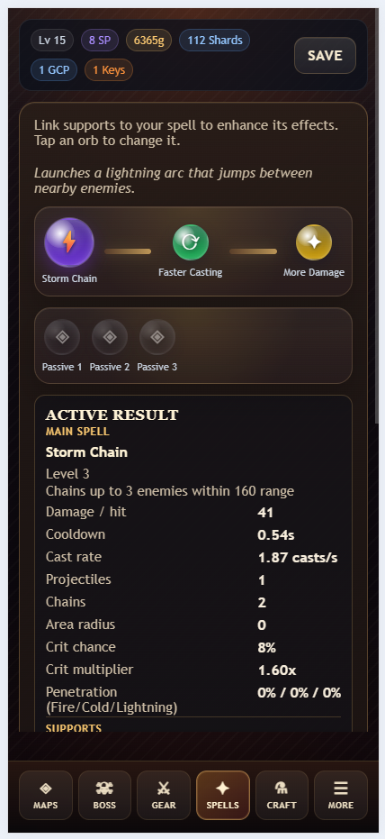
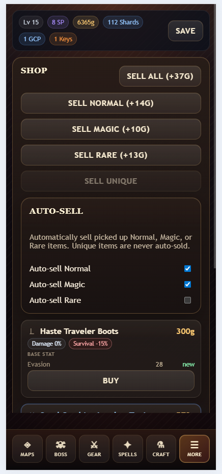
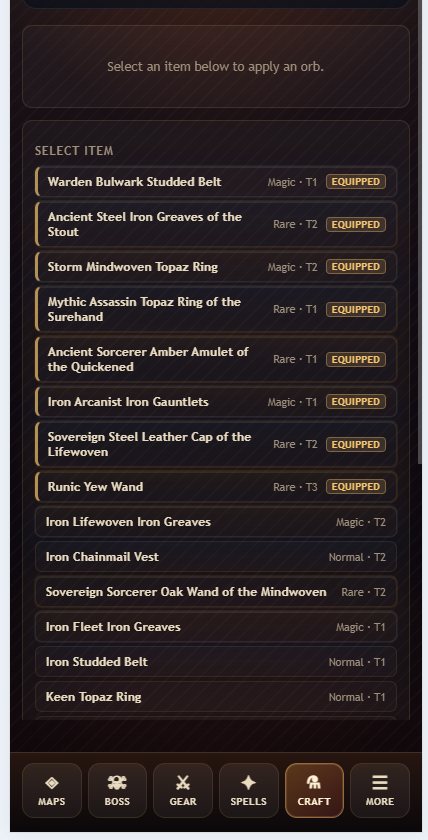

# Shardborne

Shardborne is a small full-stack action RPG prototype built to explore ARPG progression, mobile-first UI, and practical AI-assisted development.

- Demo: [https://shardborne.pages.dev/](https://shardborne.pages.dev/)
- Roadmap: [ROADMAP.md](ROADMAP.md)
- Deployment notes: [DEPLOYMENT.md](DEPLOYMENT.md)

## Screenshots











## What This Project Shows

- Full-stack gameplay prototype development with React, TypeScript, Phaser, Spring Boot, PostgreSQL, Flyway, and JWT authentication.
- Clear architecture boundaries between gameplay domain logic, rendering, app orchestration, persistence, and backend APIs.
- Saved progression across characters, inventory, equipment, spells, supports, maps, currencies, and life flask state.
- Testable gameplay systems with domain tests, app-flow tests, backend service tests, and optional database migration verification.
- AI-assisted development as a structured engineering workflow: project instructions, roadmap constraints, scoped docs, and verification habits are used to keep generated changes aligned with the architecture.

## Stack

- `frontend/`: React + TypeScript + Vite + Phaser 4
- `backend/`: Spring Boot + Java 17 + PostgreSQL + Flyway + JWT
- `docs/`: project context, command references, simulation workflow, deployment notes, and architecture references

## Current Prototype

The current build includes:

- account registration and login
- character creation with stat allocation
- saved character progression
- arena-style combat with automatic spell casting
- enemy spawning, movement, damage, death, gold, experience, and loot
- equipment, inventory, selling, and a simple shop
- map progression with `Training Grounds`, consumable maps, `Map Shards`, and early map crafting
- spell and support progression with upgrade costs and saved levels
- FF7-inspired spell/support slot UI
- passive support slots for build-wide effects
- life flask charges gained from kills
- compact mobile-first menus and pickers
- session and autosave guardrails around arena runtime updates and character persistence

## Architecture

Shardborne keeps the gameplay rules separate from the UI and renderer:

- `frontend/src/game/domain`: gameplay source of truth for combat, progression, maps, items, spells, and player rules
- `frontend/src/game/config`: centralized balance and content config
- `frontend/src/game/phaser`: Phaser rendering adapter for arena snapshots
- `frontend/src/app`: React screen composition, hub flow, persistence orchestration, and mobile-first UI state
- `frontend/src/api`: frontend API client helpers and auth/game requests
- `backend/src/main/java/com/shardborne/auth`: register/login flow
- `backend/src/main/java/com/shardborne/character`: character APIs, save DTOs, persistence mapping, and stat calculation
- `backend/src/main/resources/db/migration`: Flyway migrations for account and save data

## AI-Assisted Workflow

This project is intentionally built as an AI-assisted portfolio project, but the goal is not to show that AI can generate code by itself. The goal is to show how AI can be directed through normal engineering constraints:

- architecture rules are documented in `AGENTS.md` files
- phase priorities and acceptance criteria live in `ROADMAP.md`
- deeper context is split into focused docs instead of one oversized prompt
- gameplay logic is kept in testable domain modules
- persistence changes are checked across frontend types, backend DTOs, mapping, and migrations
- generated changes are expected to be verified with focused tests or clearly reported if not verified

## Local Quick Start

Prerequisites:

- Node.js and npm
- Java 17
- Maven
- PostgreSQL

Run locally:

```powershell
.\clean-start-dev.ps1
```

Then open:

```text
http://localhost:5173
```

To test the main flows:

1. Register a new account.
2. Create a character.
3. Run `Training Grounds`.
4. Try spell selection, linked supports, upgrades, flask usage, loot, selling, shop purchases, map progression, and shard crafting.

For detailed setup, local secrets, Git notes, and future packaging notes, see [docs/LOCAL_WORKFLOW.md](docs/LOCAL_WORKFLOW.md).

## Verification

Frontend build:

```powershell
cd frontend
npm run build
```

Frontend tests:

```powershell
cd frontend
npm test
```

Backend tests:

```powershell
cd backend
mvn test
```

Fresh database migration verification:

```powershell
.\verify-fresh-backend-db.ps1
```

For the full command reference, see [docs/COMMANDS.md](docs/COMMANDS.md). For simulator usage, see [docs/SIMULATION.md](docs/SIMULATION.md).

## Documentation

- [ROADMAP.md](ROADMAP.md): current phase, accepted work, deferred work, and next direction
- [DEPLOYMENT.md](DEPLOYMENT.md): public demo and Cloudflare deployment flow
- [LICENSE.md](LICENSE.md): portfolio-use license notice
- [docs/ASSET_CREDITS.md](docs/ASSET_CREDITS.md): third-party asset credits and reuse notes
- [docs/INDEX.md](docs/INDEX.md): documentation overview
- [docs/PROJECT_VISION.md](docs/PROJECT_VISION.md): product direction and portfolio angle
- [docs/SYSTEM_FLOWCHARTS.md](docs/SYSTEM_FLOWCHARTS.md): system and persistence flowcharts
- [docs/VISUALS.md](docs/VISUALS.md): visual system notes
- [docs/ASSET_MAPPING.md](docs/ASSET_MAPPING.md): asset mapping reference

## License

This repository is shared as a portfolio and demo project. It is not open source. See [LICENSE.md](LICENSE.md) and [docs/ASSET_CREDITS.md](docs/ASSET_CREDITS.md).
