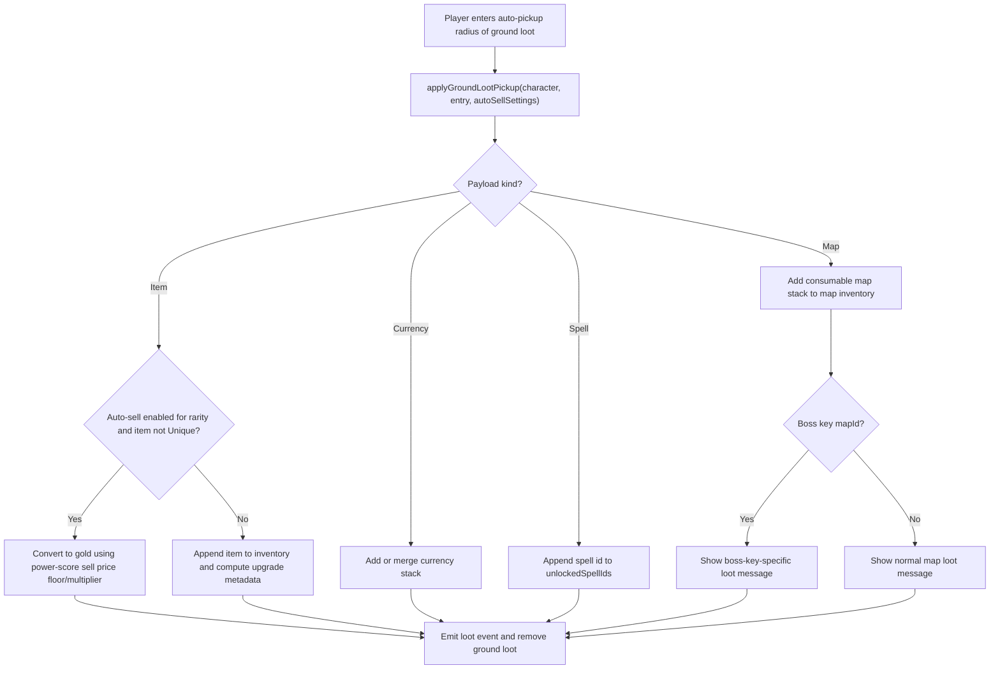
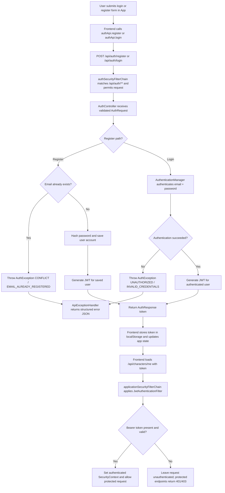
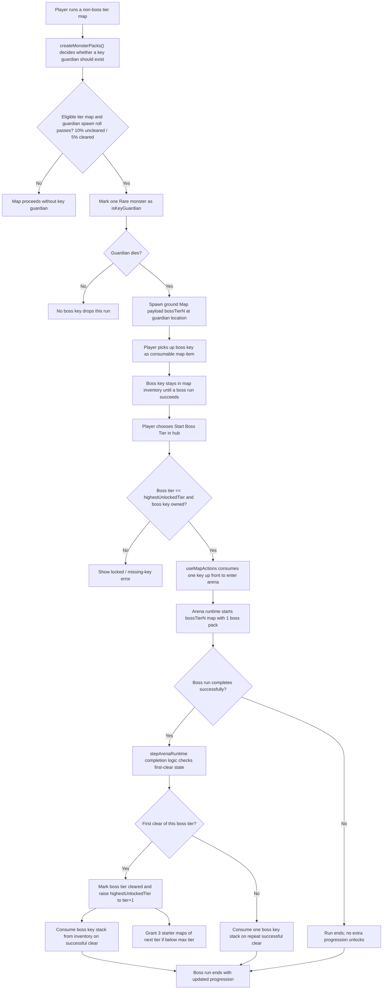
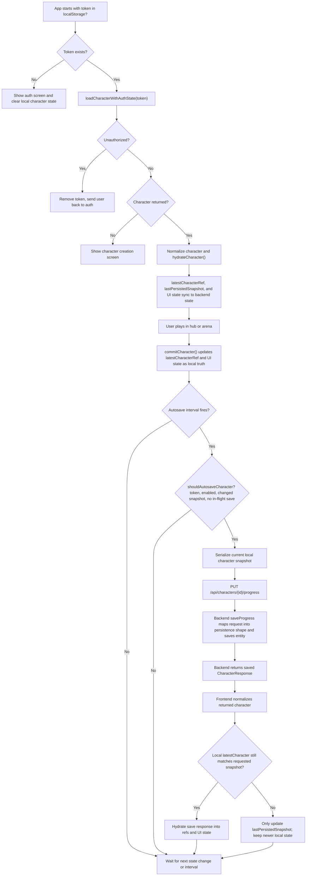
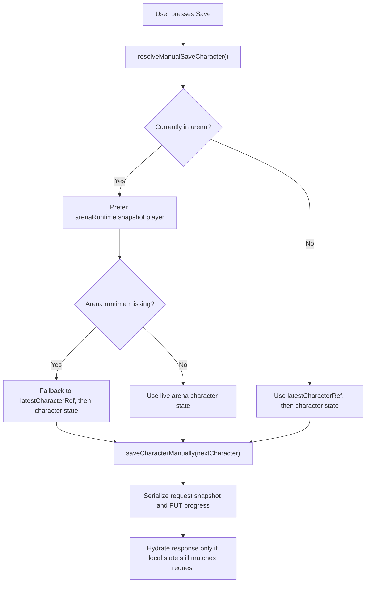
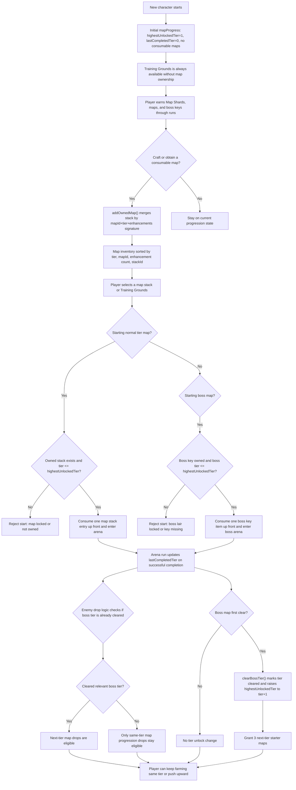

# System Flowcharts

This document captures the current technical flow for a few high-value systems in Shardborne.

These diagrams aim to reflect shared domain and persistence behavior, not just UI navigation.
When behavior changes, update the relevant diagram alongside the code.

## Combat

Primary code paths:

- `frontend/src/game/domain/combat/arenaSimulation.ts`
- `frontend/src/game/domain/spells/spellEngine.ts`
- `frontend/src/game/domain/combat/combatMath.ts`

```mermaid
flowchart TD
  A["Arena run is active"] --> B["stepArenaRuntime(deltaMs)"]
  B --> C["Advance time and clone runtime state"]
  C --> D{"Auto-move enabled?"}
  D -- Yes --> E["Choose nearest loot target or nearest living pack"]
  E --> F["Move player toward loot or pack center"]
  D -- No --> G["Keep current player position"]
  F --> H["Track moving / fighting telemetry"]
  G --> H
  H --> I["Pick up ground loot within auto-pickup radius"]
  I --> J["Aggro enemies inside aggro radius"]
  J --> K{"Enemy in contact range and damage interval ready?"}
  K -- Yes --> L["Roll evasion, then apply resistance / armor mitigation and damage player"]
  K -- No --> M["Skip enemy contact damage"]
  L --> N{"Active spell loadout and cooldown ready?"}
  M --> N
  N -- No --> O["Continue tick"]
  N -- Yes --> P["Resolve spell from main spell + linked supports"]
  P --> Q["Collect enemies in targeting range"]
  Q --> R{"Area spell?"}
  R -- Yes --> S["Target enemies inside area radius around primary target"]
  R -- No --> T["Build chain / projectile target list"]
  S --> U["Emit SpellVisualEvent for snapshot consumers"]
  T --> U
  U --> V["For each targeted enemy: roll crit, apply penetration and resistance-aware damage"]
  V --> W{"Enemy survives?"}
  W -- Yes --> X["Keep enemy with reduced health"]
  W -- No --> Y["Grant gold, experience, flask charges, telemetry"]
  Y --> Z["Roll ground drops for the kill context"]
  Z --> AA{"Was enemy the key guardian?"}
  AA -- Yes --> AB["Also spawn boss key as ground map item"]
  AA -- No --> AC["No guardian bonus drop"]
  AB --> AD["Remove dead enemy and continue"]
  AC --> AD
  X --> AD
  O --> AD
  AD --> AE["Update cleared packs and retarget auto-move"]
  AE --> AF{"All enemies dead?"}
  AF -- No --> AG["Build snapshot and continue next tick"]
  AF -- Yes --> AH["Start or continue completion delay"]
  AH --> AI{"Completion delay elapsed?"}
  AI -- No --> AG
  AI -- Yes --> AJ["Resolve map completion rewards / boss completion rules"]
  AJ --> AK["Build final ArenaSnapshot"]
```

## Lootdrop

Primary code paths:

- `frontend/src/game/domain/combat/arenaSimulation.ts`
- `frontend/src/game/domain/items/itemGenerator.ts`
- `frontend/src/game/domain/spells/spellDrops.ts`
- `frontend/src/game/config/balance/mapBalance.ts`

```mermaid
flowchart TD
  A["Enemy dies inside arenaSimulation"] --> B["rollGroundDrops(character, mapTier, rarity, map, dropX, dropY)"]
  B --> C["Load tier balance and map context"]
  C --> D{"Item drop roll passes? tier itemDropRate x map drop multipliers"}
  D -- No --> E["Skip item drop path"]
  D -- Yes --> F["Generate item for character"]
  F --> G["Pick item rarity from weighted rarity pool"]
  G --> H{"Rarity is Unique?"}
  H -- Yes --> I["Roll from global unique item pool filtered by minTier and unique weight modifiers"]
  H -- No --> J["Pick eligible item base by tier"]
  I --> K{"Unique found?"}
  K -- Yes --> L["Create unique item payload"]
  K -- No --> J
  J --> M["Roll affixes from slot-specific prefix/suffix pools"]
  M --> N["Apply tier ranges, rarity affix counts, base armor/evasion/speed stats"]
  N --> O["Maybe upgrade Rare into Exceptional Rare"]
  O --> P["Create ground Item payload"]
  L --> P
  E --> Q{"Currency roll passes? map shard / other currency logic"}
  P --> Q
  Q -- Yes --> R["Create ground Currency payload"]
  Q -- No --> S["Skip currency path"]
  R --> T{"Spell drop roll passes?"}
  S --> T
  Q --> T
  T -- Yes --> U["Roll missing spell from spell drop pool gated by map tier and owned spells"]
  T -- No --> V["Skip spell path"]
  U --> W{"Spell id returned?"}
  W -- Yes --> X["Create ground Spell payload"]
  W -- No --> V
  X --> Y{"Map drop roll passes?"}
  V --> Y
  Y -- Yes --> Z["Create same-tier map ground payload"]
  Y -- No --> AA["Skip same-tier map"]
  Z --> AB{"Next-tier maps unlocked by cleared boss?"}
  AA --> AB
  AB -- Yes --> AC{"Next-tier map roll passes?"}
  AB -- No --> AD["No next-tier map eligible"]
  AC -- Yes --> AE["Create next-tier map ground payload"]
  AC -- No --> AD
  AE --> AF["Return all ground loot entries"]
  AD --> AF
```

### Pickup And Outcome

## Login

Primary code paths:

- `frontend/src/app/App.tsx`
- `frontend/src/api/authApi.ts`
- `backend/src/main/java/com/example/arpg/auth/AuthController.java`
- `backend/src/main/java/com/example/arpg/auth/AuthService.java`
- `backend/src/main/java/com/example/arpg/config/SecurityConfig.java`
- `backend/src/main/java/com/example/arpg/security/JwtAuthenticationFilter.java`

## Boss

Primary code paths:

- `frontend/src/app/useMapActions.ts`
- `frontend/src/game/domain/combat/arenaSimulation.ts`
- `frontend/src/game/domain/maps/mapProgress.ts`

## Save / Load / Autosave

Primary code paths:

- `frontend/src/app/App.tsx`
- `frontend/src/app/useCharacterPersistence.ts`
- `frontend/src/app/characterPersistence.ts`
- `frontend/src/app/useArenaSession.ts`
- `frontend/src/api/gameApi.ts`
- `backend/src/main/java/com/example/arpg/character/CharacterProfileService.java`

### Manual Save And Arena Priority

## Map Progression

Primary code paths:

- `frontend/src/app/useMapActions.ts`
- `frontend/src/app/mapFlow.ts`
- `frontend/src/game/domain/maps/mapProgress.ts`
- `frontend/src/game/domain/combat/arenaSimulation.ts`

